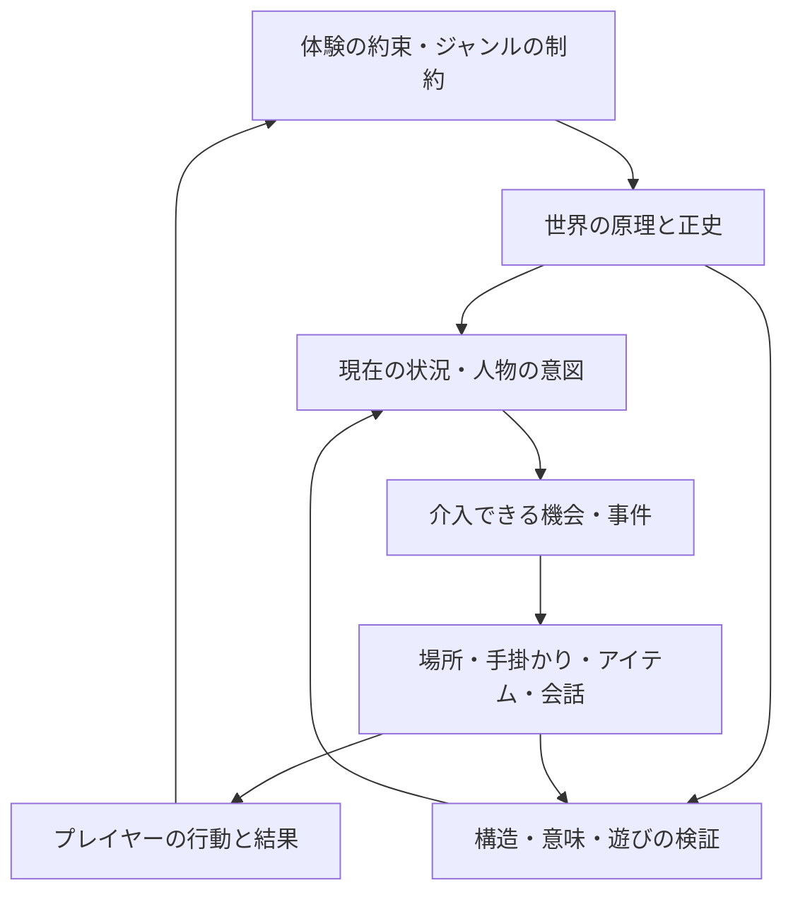
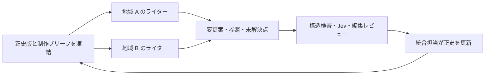

# ナラティブ／ロア構築フレームワーク案

この文書は設計提案であり、実装済み機能の一覧ではない。現在の制作CLIと探索MVPの使い方は [README](../README.md)、実際の型と検査範囲は [実装コントラクト](contracts.md) を参照する。初期の判定実験は別途記録する。

## 1. 設計の中心

作るものは、**世界の原因から、プレイヤーが介入できる状況と発見を導く制作基盤**とする。設定の追加だけでなく、その設定が誰の行動を変え、何を遊べるようにするかを追跡する。

エルデンリングの制作では、宮崎氏のテーマ・アイデア・ゲームに関する構想について対話した後、Martin 氏が世界の神話を書き、それを基に世界が構築された。神話を完全に独立して最初に作った、とまでは読み取れない。[宮崎英高インタビュー、Xbox Wire / Bandai Namco、2019](https://news.xbox.com/en-us/2019/06/09/hidetaka-miyazaki-and-george-rr-martin-present-elden-ring/)

この事例から得る設計仮説は、**「プレイヤー体験を仮置き → 世界の原理と過去 → 現在に残る傷跡 → 発見と介入」**という往復である。神話を入口の一つとして扱い、どの入口でも同じ世界モデルに合流させる。

## 2. 四つのジャンルをどう持つか

ジャンルは名称や語彙のテンプレートではなく、**説明してよい範囲、守る制約、期待する発見と介入**のプリセットとする。ジャンルと構築の入口は独立に選べる。

さらに「継承の代償」「善意の装置の破綻」「希少資源と相互依存」などの対立の型を別軸として持つ。具体例は [アーキタイプの組合せ](archetypes.md) を参照。

| プリセット | 先に決める核 | 生まれやすい対立 | プレイヤーの動詞 | 特有の検証 |
| --- | --- | --- | --- | --- |
| ダークファンタジー | 秩序を成立させる原理、その代償、歴史的な破綻 | 秩序の維持者と犠牲者、継承と拒絶 | 探る、戦う、継ぐ、壊す、捧げる | 力の代償、破綻が地理・身体・制度に残す痕跡 |
| 創作都市伝説／怪異 | 怪異の観測可能な規則、例外の境界、隠蔽の構造 | 個人の救済と封じ込め、記録と禁忌 | 調査する、試す、隔離する、隠す、公開する | 原因が不明でも発動条件は一貫するか、資料の信頼性 |
| ハード SF | 物理・技術・資源・通信の制約、許す仮説 | 資源配分、遅延、所有権、世代間の利害 | 測る、設計する、配分する、交渉する | 単位・収支・移動時間・情報の到達時間、技術の社会的帰結 |
| 現代ミステリー | 事件の実際の経緯、機会・手段・動機、証拠の発生 | 真相と守りたいもの、捜査と偽証 | 聞く、比較する、検証する、推理する、告発する | 時系列・アリバイ・知識経路、解決に必要な証拠への到達 |

怪異の原因を完全に説明することと、作品内の制約が一貫することは別。SCP も複数の共有カノンを持つため、整合性の範囲をプロジェクト単位で明示する。[SCP Canon Hub](https://scp-wiki.wikidot.com/canon-hub)

同じ怪異系でも、封じ込めと実験を中心にする形式と、知るほど世界観が崩れる形式では開示方針が異なる。プリセット内で `explanationPolicy` と `resolutionPolicy` を分ける。ミステリーで超常現象を許す場合も、解決に必要な規則は推理可能な形で事前に示す、などの約束を設定する。

## 3. どこから作り始めるか

| 入口 | 初期入力 | 構築の順序 | 失敗しやすい点 |
| --- | --- | --- | --- |
| 神話／歴史 | 世界を変えた原理・禁忌・破綻 | 原理 → 決定的事件 → 地理と制度 → 利害 → 介入 | 設定が大きくなる一方、現在の人間の問題が薄い |
| キャラクター | 欲求、恐れ、誤信、守りたい関係 | 欲求 → 必要な資源／制度 → 障害 → 行動 → 世界への痕跡 | 人物の都合で世界の原理が変わる |
| シナリオ／事件 | 開始状況、変化、プレイヤーの介入 | 実際の因果 → 各人の知識 → 証拠 → 複数の解決 → 必要な設定 | 結末のために人物が不自然に動く |
| 場所／物 | 奇妙な景観、使いたい道具、痕跡 | 観測 → 原因候補 → 持ち主と利用者 → 歴史 → 行動機会 | 雰囲気だけで因果や操作がない |
| システム／科学 | 遊びの規則、資源制約、科学的仮説 | 制約 → 生活と産業 → 格差 → 人物 → 事件 | 理屈が正しくても感情的な賭け金がない |

入口を固定する必要はない。人物から作った欲求が神話の代償を具体化し、事件から作った証拠が歴史を更新する、という循環を認める。ただし採用済みの原理を変える場合は明示的な改訂として扱う。

最小の入力は「何を感じてほしいか」「主な行動を三つ」「世界の原理を一つ」「変えられない制約を三つ」「現在の対立を一つ」。宇宙の全史を埋める必要はない。

## 4. 共通の世界モデル

保存する状態、命題の型、差分採用 API の詳細は [コントラクト草案](contracts.md) にまとめた。

### 4.1 要素と関係

カテゴリは編集の入口とし、因果・所属・観測・所有・対立などの関係を第一級のデータにする。歴史は年表、地理は地図、人物は関係図として同じデータから表示できる。

| カテゴリ | 必要な情報の例 | 他の要素との関係 |
| --- | --- | --- |
| 歴史／時代 | 期間、前後関係、転換点、記録者 | 事件が制度や地形を変えた |
| 地理／場所 | 接続、環境、移動費用、資源、痕跡 | 国が支配し、動物が生息する |
| 人物 | 欲求、恐れ、能力、資源、関係、知識、誤信 | 組織に属し、アイテムを求める |
| 動物／生態 | 生息条件、食物、行動、利用、影響 | 資源循環や危険、文化を生む |
| 怪異 | 発動条件、観測結果、限界、対処、未解決点 | 事件を起こし、組織が対処する |
| 事件 | 前提、参与者、場所、行為、結果、証拠 | 人物の意図から生じ、歴史に残る |
| 組織 | 目的、構成員、権限、資源、内部対立 | 国の制度や怪異への対応を担う |
| 国／政治体 | 領域、制度、正統性、経済、外交 | 地理と資源に支えられ、組織を統治する |
| アイテム | 由来、機能、費用、所有、制約 | 事件の証拠、能力や選択の入口になる |
| エピソード | 開始条件、発見、選択、結果、提示媒体 | 複数の世界要素を遊べる単位へ束ねる |
| 原理／技術／制度 | 適用範囲、例外、代償、根拠 | 他の要素が従う制約になる |

動物や国にも「ゲームでの役割」を持たせる。ただし背景要素の全てにクエストを要求せず、環境・文化・対比を担う要素はその用途を示す。

### 4.2 真実・信念・資料・未確定を区別する

命題 `Claim` には ID、主語、述語、値、時間範囲、分岐、出典を持たせる。その命題をどう扱うかは別の `Assertion` で表す。

- **authorTruth**: 作者側で確定した世界の事実。プレイヤーに見せるとは限らない。
- **belief**: 人物や組織が命題を信じているという事実。命題自体の真偽は別。
- **record**: 資料がそう述べているという事実。資料の内容を自動的に正史へ昇格しない。
- **hypothesis**: 解釈の候補。相互排他的な候補も併存できる。
- **unresolved**: 作者側でも未確定。決定を留保する範囲と、破ってはいけない周辺制約を記す。

これとは独立に `draft / proposed / accepted / superseded` の採用状態と、情報開示の条件を持つ。**採用済みの偽証は「偽証として正史に存在する」**のであり、内容まで真になるわけではない。

同じ主語・述語でも、時間や分岐が異なれば値の変化を許す。矛盾は同じ条件下で両立しない断定に対して判定する。時点は世界内時間、改訂日時は制作上の時間として分ける。

正史に書かれていないことは原則として未記載であり、偽とはしない。禁止された蘇生や通信速度などの不変条件は、記載の有無にかかわらず守る。

### 4.3 人物の知識とプレイヤーの知識

「何が真実か」「誰が何を知り／信じているか」「どの操作でプレイヤーに伝わるか」を分ける。秘密を知る経路は、目撃・会話・記録・推論・実験などで明示する。

作者の真実を確認する判定器には必要な秘密を渡す。NPC の会話生成には、その人物が利用できる情報だけを渡す。断片資料を書くライターには作者の真実と、その資料に出してよい情報を別々に指定する。

隠された真実があっても、プレイヤーに一意の解釈を要求しない作品を許す。その場合でも、どの解釈がどの手掛かりで支えられるかを管理する。

## 5. 設定をゲームに接続する

各エピソードは最低限、次の契約を満たす。

1. **開始状況**: 誰が何に困り、プレイヤーがなぜ関わるか。
2. **発見**: どの行動で何を観測し、理解や利用可能な行動がどう変わるか。
3. **介入**: 実行できる行為、その前提・費用・危険。
4. **結果**: 状態・関係・資源・知識に何が変わるか。
5. **提示**: 場所、会話、挙動、アイテム、資料、戦闘の何で伝えるか。

探索には迂回や発見順の違い、選択には相互に異なる結果、戦闘には設定を読んだことが有利に働く余地を作る。背景ロアは行動を豊かにすればよく、全てを選択肢に変換する必要はない。

**因果のグラフ**と**発見のグラフ**を別に作る。事件が起きた順序と、プレイヤーが理解する順序は違う。特にミステリーでは真相を先に固定し、証拠からそこへ到達する複数の経路を設計する。

重要な結論に複数の手掛かりを用意する方針は、Three Clue Rule を制作上の経験則として参考にする。手掛かりの数だけでは公平な推理を保証しないため、取得条件と推論に必要な前提も調べる。[Justin Alexander、2008](https://thealexandrian.net/wordpress/1101/roleplaying-games/three-clue-rule-part-3-the-three-clue-rule)

エンジンへの出力は、場所・会話・アイテム説明・クエストの状態遷移・条件付きイベントに分ける。初期はエンジン非依存の JSON と Markdown に留め、会話／分岐の出力先として ink などを検討する。[ink 公式](https://www.inklestudios.com/ink/)

エピソードは、内容・実行前提・実行後の状態変化を持つ Storylet として表現する案が適していると考える。背景ロアの要素と、実行できるエピソードは別に保持し、参照で結ぶ。[Emily Short、2019](https://emshort.blog/2019/11/29/storylets-you-want-them/)

## 6. 判定を三層に分ける

### 層 A: 機械的な検査

ID・参照・型、採用済み命題の衝突、時系列、移動時間、単位・資源収支、前提と効果、開示条件をコードで検査する。計算可能な物理や経済のモデルは、物語上必要な範囲で定義する。

クエストは条件と効果を持つ状態遷移として検査する。有限の抽象状態上で、必須の手掛かりの取得可能性、到達不能、選択後の詰みを探索する。実ゲームの全状態を列挙することは前提にしない。エンジンとの対応ができた段階で Playwright の E2E を追加する。

### 層 B: Jev による局所的な意味の検査

変更案、関連する正史、不変条件、時間・分岐・情報開示の範囲を渡し、原子的な問いをまとめて聞く。

- 同じ条件下で正史を覆す断定があるか。
- 信念や資料の内容を作者の真実へ混同していないか。
- 行動は人物の目的と手持ち情報で説明できるか。
- 未許可の例外を使って世界の制約を回避していないか。
- 開示前の秘密をプレイヤーへ伝えていないか。
- 具体的な行動と結果につながる足場があるか。
- 列挙した分類では判断できない問題があるか。

Jev は文章生成を担当せず、長い因果の証明や矛盾の完全検出も要求しない。公式資料も、限定された原子的な問いをコードで合成する使い方を勧めている。[TypeSafe Introduction](https://docs.typesafe.ai/introduction)

**Jev の回答は採用判断の材料**とする。矛盾の疑いが出たら、参照した命題 ID と候補の箇所を添えて詳細レビューへ送る。Jev の確率値から説明文や証拠を捏造しない。

### 層 C: 編集判断とプレイテスト

整合性が高くても、平凡・説明過多・行動不能な設定は残る。魅力を一つの点数に集約せず、「具体的な発見」「葛藤」「予想が更新される点」「場所や行為の想像しやすさ」「ジャンル内での独自性」を別に検討する。

最終的には少人数のプレイテストで、何を理解したか、どこへ行きたくなったか、どの選択に迷ったかを確認する。Jev の遊び判定は、面白さの実証として扱わない。

LLM による評価では位置・長さ・自己評価の偏りが報告されている。これを Jev 固有の性能と断定せず、本プロジェクトでも提示順の反転、長さの対照、人間の評価との比較を用意する。[Zheng ほか、2023](https://arxiv.org/abs/2306.05685)

## 7. 高速な差分判定

変更された要素から、明示参照・逆参照・関連する制約・時間・知識経路をたどって判定用の文脈を作る。検索だけで局所文脈を選ぶと、遠い因果を見落とすため、原理を変更した場合は全体監査へ送る。

同じ文脈への複数の質問はバッチにする。キャッシュキーには正史版、入力差分、取得した命題、文脈構築器版、モデルの実名、ルーブリック版を含める。`jev-latest` という別名だけでモデルの更新を追跡しない。

取得範囲を十分に確認できない、未知分類、境界帯、API 失敗、不正レスポンスは `needs-review` にする。判定できなかった変更を自動採用しない。confidence は回答分布由来で、必要な情報が欠けたことまで保証しない。[TypeSafe Confidence](https://docs.typesafe.ai/confidence)

`jev-playground` のクライアントと実験から、環境変数名の互換、質問のバッチ化、分類の逃げ道、文脈サイズ、指標別の校正を参考にした。ただしそこでの速度・料金・精度を本タスクへ外挿しない。[リポジトリ](https://github.com/mizchi/jev-playground)

## 8. 並列ライターの契約

初期の核が固まるまでは、一つの文脈で世界の原理と現在の対立を作る。並列化は共有契約を凍結してから行う。

ライターへの入力は、正史版、関係する要素、作者の真実、開示可能な情報、担当領域、追加可能な要素、変更禁止事項、エピソードの目的、出力形式とする。全文の会話履歴を配る必要はない。

分割は「歴史担当／人物担当」のように強く相互依存する分類より、**固定された正史を使う別の地域、事件、人物のエピソード**が向く。共通の歴史や国家を変更する提案は別の変更要求として返す。

ライターは正史を直接編集しない。統合担当が採用時に正史版と競合を再検査し、矛盾があれば差し戻す。同時に採用すると衝突する提案も、合わせた差分に対して再判定する。修正回数は上限を持ち、未解決点を隠して延々と再生成しない。

この構成は現在使用した `multi-agent-orchestration` スキルの、依存関係・書込範囲・検証可能な成果物を先に定義する方針を適用したもの。

## 9. MVP の切り方

この設計研究では、まず四ジャンルの小規模判定実験と、同一世界の並列制作を行う。次に実装する MVP は、**一地域・一つの主要な対立・二つの短いエピソードを、追加と差分判定まで通せる制作 CLI**とする。

1. **状態とコントラクト**: Entity、Claim、Assertion、Rule、Episode、Proposal のスキーマ。正史版、差分、採用履歴、作者／人物／プレイヤーの情報を保存する。
2. **決定的な検証**: 参照、時間、単一値命題、禁止事項、開示条件。Red → Green → Refactoring で実装する。
3. **Jev の差分評価**: 関連文脈、原子質問、キャッシュ、レビューへの振分け。校正用と評価用のケースを分ける。
4. **遊べる試作**: 小さなテキスト探索で、断片の発見と二つの介入を確認する。到達性の検査と、接続した UI の Playwright E2E を行う。
5. **並列制作**: 固定したブリーフから二ライターで候補を作り、統合前後の整合性を比較する。

初期の保存は JSON / JSONL、編集用の文章は Markdown で十分。参照や検索が重くなったら SQLite と全文検索を導入する。知識グラフ DB、全面的なシミュレーション、常時動く NPC は必要性が実証されてから検討する。

評価項目は、矛盾の適合率・再現率、伝承を誤って弾く率、秘密の早期開示、未判定率、文脈取得の欠落、判定時間・入力量、作者が修正した箇所、プレイテストでの発見と選択。現段階では数値 KPI を仮に達成扱いしない。

## 10. 次の設計判断

制作支援として設計し、生成と検証は制作時に行う仮定を置いた。ゲーム中にも NPC や事件を生成する場合は、実行可能な行動の集合、セーブ再現性、秘密の分離、実行時間の契約を追加する必要がある。

最初の試作で確かめたいのは、設定の量ではなく「一つの世界の原理が、地理、制度、人物の欲求、アイテムの使い道、プレイヤーの迷う選択に一貫して現れるか」である。
